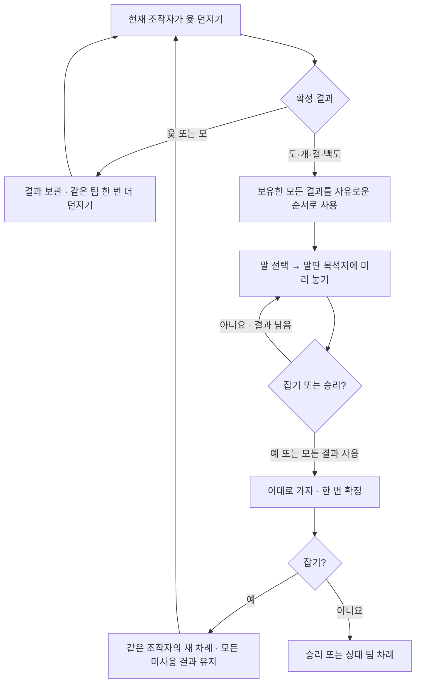

# 윷놀이: 규칙, 팀 협업, 프로토콜과 화면

이 문서는 `packages/yutnori`와 공통 방 서버가 구현하는 규칙을 설명한다. 지역마다 다른 윷놀이 관습 가운데 아래 규칙을 채택했으며, 판정은 RoomDO에서 실행되는 게임 어댑터가 담당한다.

## 시작하기와 팀 구성

| 방식 | 게임 화면에서 들어갈 로비 | 필수 인원 | 팀 |
| --- | --- | --- | --- |
| 개인전 | `/game/yutnori/solo` | 정확히 2명 | 각자 한 팀, 네 말 |
| 팀전 | `/game/yutnori/team-2v2` | 정확히 4명 | 두 명씩 한 팀, 팀당 네 말 |

팀전에서 좌석 0·2는 청팀 A, 좌석 1·3은 홍팀 B다. 화면의 1·3번 자리와 2·4번 자리에 해당한다. 각 팀 안에서는 좌석 순서가 조작 순서다. 대기실에서는 현재 참가자와 좌석으로 팀을 다시 계산하고, 게임 시작 시 팀을 확정한다. 세 명으로 시작하거나 팀전 정원을 두 명으로 위조할 수 없다. 봇은 지원하지 않으며 UI와 서버 모두 추가를 막는다.

방 생성 시 빽도 사용 여부를 고를 수 있다. 기본값은 사용이다. `rules.backDo`와 `rules.finish: "pass-exit"`는 시작한 게임의 고정 규칙이다. 모든 참가자가 준비하면 방장이 시작한다. 경기 도중 명시적 퇴장이나 연결 종료 유예 만료로 참가자가 나가면 공통 `activeInterruption` 흐름으로 멈추고, 정원을 충족한 뒤 방장이 재시작한다. 재시작·재대전은 새 `matchId`, 대기 상태의 말, 현재 좌석에 따른 팀으로 초기화한다.

API로 팀전을 만드는 예:

```sh
curl -X POST http://localhost:8787/games/yutnori/lobbies/team-2v2/rooms \
  -H 'content-type: application/json' \
  -d '{"playerId":"p1","displayName":"민수","config":{"backDo":true}}'
```

## 네 가락의 결과

서버가 `crypto.getRandomValues()`로 네 면과 별도의 연출 시드를 만든다. `faces[i] === true`는 해당 가락의 평평한 면이 위를 향함을 뜻한다. 둥근 면에는 어두운 X가 세 개 있고 평평한 면에는 무늬가 없다. 0번 빽도 가락의 평평한 면에만 작은 빨간 채워진 원이 있다. 서버의 면 정의와 화면 모양은 3D·정적 대체 화면·최근 결과 요약에서 같다. 현재 구현은 각 면을 난수 비트로 선택하며 실물 윷의 무게·마찰에 따른 확률을 재현하는 물리 모형은 아니다.

| 평평한 면 개수 | 결과 | 이동 | 추가 던지기 |
| --- | --- | --- | --- |
| 0 | 모 | 5칸 앞으로 | 1회 |
| 1 | 도 | 1칸 앞으로 | 없음 |
| 2 | 개 | 2칸 앞으로 | 없음 |
| 3 | 걸 | 3칸 앞으로 | 없음 |
| 4 | 윷 | 4칸 앞으로 | 1회 |
| 0번 가락만 평평한 면, 빽도 사용 중 | 빽도 | 실제 지나온 길로 1칸 뒤로 | 없음 |

빽도를 끈 방에서는 0번 가락만 평평한 면이어도 도다. 범례와 규칙 안내에도 빽도 미사용을 표시한다. 클라이언트는 `throwYut`에 빈 payload만 보낸다. 면·결과·시드를 보내서 결과를 고를 수 없다.

## 윷판과 이동 경로

윷판에는 29개의 고유 밭이 있다. `reserve`와 `finished`는 판 밖 상태로, 29개에 포함되지 않는다.

| 구간 | 노드 순서 | 이동 규칙 |
| --- | --- | --- |
| 바깥길 | `o0 → o1 → … → o19 → o0` | `o0`는 오른쪽 아래 출발·도착점 |
| 지름길 A | `o5 → a1 → a2 → c → a3 → a4 → o15` | 오른쪽 위에서 왼쪽 아래로 |
| 지름길 B | `o10 → b1 → b2 → c → b3 → b4 → o0` | 왼쪽 위에서 오른쪽 아래로 |
| 대기 말 출발 | `reserve → o1` | 첫 번째 이동이 이미 한 칸을 사용함 |
| 완주 | `o0 → finished` | 도착점에서 앞으로 한 칸 더 나가야 완주 |

말이 이동을 **시작하는** 밭에서만 분기한다. `o5`에서 바깥길 또는 지름길 A, `o10`에서 바깥길 또는 지름길 B를 고른다. 중앙 `c`에서 시작하면 A의 남은 방향 또는 B의 남은 방향을 고를 수 있다. 이번 이동 도중 모서리나 중앙을 지나가기만 했다면 그 자리에서 꺾지 않는다. 지름길을 빠져나오면 바깥길로 이어진다.

예를 들어 대기 말에 도를 사용하면 `o1`에 놓인다. 대기 말에 모를 사용하면 `o5`까지 가고, 다음 결과를 사용할 때 지름길 A를 선택할 수 있다. `o19`에서 도를 쓰면 `o0`에 도착하고 아직 완주하지 않는다. `o19`에서 개 이상을 쓰면 출구를 지나 완주한다. 완주에 필요한 칸 수보다 큰 결과를 써도 남는 걸음 때문에 실패하지 않는다.

빽도는 임의로 다른 역방향 길을 고르는 방식이 아니다. 말의 `history`에 저장된 직전 노드와 경로로 돌아간다. 따라서 중앙·지름길에서도 실제 진입 경로를 되짚는다. 첫 출발 칸 `o1`에서 빽도를 쓰면 대기로 돌아간다. 대기 말과 완주한 말은 빽도로 움직이지 않는다.

## 말 놓기, 업기, 잡기, 완주

1. **말 놓기:** 팀마다 네 말 `A1…A4`, `B1…B4`가 대기한다. 결과 하나를 골라 대기 말 한 개를 이동시킨다. 무료로 판에 올리는 동작은 없다.
2. **업기:** 이동이 끝난 밭에 같은 팀 말이 있으면 하나의 묶음으로 합쳐진다. 이후 어느 말을 선택해도 `stackId`가 같은 말 전부가 이동한다. 임의로 일부만 떼어낼 수 없다. 합쳐진 묶음은 이동해 온 묶음의 경로·이동 이력을 함께 사용한다.
3. **잡기:** 도착한 밭의 상대 묶음 전체를 대기로 되돌린다. 지나친 밭은 잡지 않는다. 상대 말 수와 관계없이 잡기 한 번으로 같은 팀·같은 조작자의 새 차례가 시작되고 반드시 먼저 던질 기회 한 회를 얻는다. 이전에 사용하지 않은 모든 결과는 종류와 관계없이 유지한다. 잡힌 말의 경로·이력은 초기화되고 각각 대기 말로 분리된다.
4. **대기로 역행:** 빽도로 묶음이 대기에 돌아오면 개별 대기 말로 분리된다. 대기는 업는 밭이 아니다.
5. **완주:** 묶음이 출구를 지나면 묶음 전체가 완주한다. 네 말이 모두 완주한 팀이 즉시 승리한다. 남은 결과나 추가 던지기가 있어도 게임은 끝난다. 팀전 승리는 `winnerTeamId`와 `winnerPlayerIds`로 표현하며 한 명만 승자로 기록하지 않는다.

## 한 차례의 진행



윷·모가 나오면 결과를 보관하고 같은 팀이 한 번 더 던진다. 남은 던지기는 이동보다 먼저 사용한다. 던지기가 끝나면 도·개·걸·윷·모·빽도를 **종류와 관계없이 원하는 순서로** 쓴다. 예를 들어 모로 대기 말을 모서리에 놓은 뒤 개로 지름길을 갈 수 있고, 개 다음 모를 써 바깥길로 갈 수도 있다. 이전 스냅샷의 `disposition`은 호환용 자료이며 사용 순서를 제한하지 않는다.

말을 먼저 선택하면 보유 결과로 갈 수 있는 목적지가 말판에 나타난다. 목적지를 선택할 때마다 해당 수가 자동으로 가상 말판에 반영된다. 여러 경로가 같은 목적지에 닿을 때만 그 위치에서 경로를 고른다. 별도의 ‘이동 계획에 추가’ 단계는 없다. 한 수 무르기가 가능하며, 모든 결과를 배치하거나 잡기·승리에 도달하면 **이대로 가자!** 한 번으로 `commitMoves`를 제출한다. 단일 결과도 같은 미리보기·최종 확인 흐름을 사용한다.

빽도처럼 움직일 수 없는 결과는 선택한 순서에서 실제 합법 이동이 없을 때만 소진할 수 있다. 다른 결과를 먼저 사용하면 빽도가 유효해질 수 있으므로 자동으로 버리지 않는다. 소진도 `{rollId, discard: true}`를 같은 순서에 넣어 서버가 해당 시점의 말판으로 검증한다.

잡기는 정확히 그 수에서 멈춘다. 미사용 결과는 윷·모뿐 아니라 도·개·걸·빽도까지 모두 보존한다. 서버는 같은 조작자의 `turnId`를 증가시키고 `mandatoryThrows`를 부여한다. 먼저 다시 던진 뒤 기존 결과와 새 결과의 순서를 새 말판에서 자유롭게 정한다. 잡기 뒤의 이동까지 미리 전송한 계획은 거절한다.

일반 교대는 A → B → A → B이며 팀 안 조작자도 번갈아 맡는다. 좌석순 `p1,p2,p3,p4`이면 일반 교대 조작자는 `p1 → p2 → p3 → p4 → p1`이다. 잡아서 시작한 새 차례는 이 교대 순서를 앞당기지 않는다. `normalTurnIndex`로 일반 교대와 잡기 차례를 구별한다. 네 말 완주 시에는 남은 던지기·이동권과 관계없이 즉시 승리한다.

## 상태와 일반 액션

주요 구현 파일:

| 파일 | 책임 |
| --- | --- |
| `packages/yutnori/src/types.ts` | 상태·결과·경로·제안 타입 |
| `packages/yutnori/src/board.ts` | 29개 밭, 경로 전이, 합법 이동 계산 |
| `packages/yutnori/src/rules.ts` | 단일 이동 적용, 자유 순서 이동·소진 시뮬레이션, 공통 연출 시간 |
| `packages/yutnori/src/server.ts` | 난수·차례·검증·이동·승리·제안 검증 |
| `packages/yutnori/src/client.ts` | 말판·선택·제안·알림·공통 UI 연결 |
| `packages/yutnori/src/scene.ts` | 서버 결과에 수렴하는 Three.js 연출 |
| `src/core/teams.ts` | 서버 팀 명단 정규화와 팀 메시지 사용 조건 |
| `src/do/room.ts` | 버전·중복 액션·소켓·팀별 전달·저장 |

공개 상태는 `matchId`, `rules`, `teams`, `pieces`, `currentPlayerId`, `turn`, `lastThrow`, `lastMove`, `lastMoveSequence`, `legalMoves`, 승리 정보를 포함한다. `turn`에는 `turnId`, `teamId`, `controllerPlayerId`, `throwsRemaining`, `mandatoryThrows`, `normalTurnIndex`, 결과 배열 `pending`이 있다. `getPrivateView()`는 빈 객체다. 팀 제안은 상태에 저장하지 않고 승인된 팀원에게만 일시적으로 전달한다.

```json
{
  "type": "action",
  "playerId": "p1",
  "clientActionId": "unique-action-id",
  "expectedVersion": 12,
  "action": { "type": "throwYut", "payload": {} }
}
```

| `action.type` | `payload` | 서버 확인 사항 |
| --- | --- | --- |
| `throwYut` | `{}` | 현재 조작자, 남은 던지기, 연출 종료 |
| `movePiece` | `{ "rollId": "r1", "pieceId": "A1", "pathId": "outer" }` | 레거시 단일 이동 호환, 남은 던지기 없음, 현재 서버 `legalMoves`의 일치 |
| `commitMoves` | `{ "matchId": "m1", "turnId": 1, "moves": [{ "rollId": "r2", "pieceId": "A1", "pathId": "outer" }] }` | 모든 결과의 연속 이동·소진 시뮬레이션, 경기·차례, 완결 계획, 잡기/승리 중단점 |
| `discardRoll` | `{ "rollId": "r1" }` | 해당 결과로 가능한 이동이 하나도 없음 |

`pathId`는 `outer`, `diagonalA`, `diagonalB`, `back` 중 서버가 해당 선택에 공개한 값을 쓴다. 클라이언트가 예상 도착점·잡을 말·이동 칸 수를 제출하지 않는다. 서버는 실제 상태에서 경로를 다시 계산한다. 일반 액션에는 RoomDO의 `expectedVersion` 검사와 플레이어별 `clientActionId` 중복 처리가 적용된다. 이미 승인된 던지기의 같은 액션 ID를 다시 보내도 새 난수를 만들지 않는다.

던지기 결과는 서버에서 즉시 확정하지만, `startedAt + durationMs + THROW_RESULT_HOLD_MS` 이전에는 다음 던지기·말 이동·결과 소진·이동 제안을 거절한다. 기본 `durationMs`는 1,800이고 결과 확인 시간 `THROW_RESULT_HOLD_MS`는 800이다. 공개 `legalMoves`는 연출 중에도 제공하므로 브라우저는 종료 시각과 차례 제약을 확인해 입력을 풀 수 있으며 별도 타이머 스냅샷을 기다리지 않는다. 말 이동도 `lastMoveSequence.startedAt + durationMs`까지 추가 입력을 잠근다.

단일 이동과 일괄 계획은 `lastMoveSequence: { sequenceId, startedAt, durationMs, moves }`를 공개한다. 각 이동은 자기 `startedAt`과 실제 경로·잡힌 말·업힌 말·완주 말을 갖는다. 서버 말판은 확정된 최종 상태이며 클라이언트는 중간 말판을 재구성하여 이동들을 순차 연출한다. 재접속은 경과한 시간에 맞춰 합류하며 지난 연출을 처음부터 반복하지 않는다. 승리 결과창도 마지막 이동 연출이 끝난 뒤 표시한다.

공개 이벤트는 `yutnori.thrown`, `yutnori.moved`, `yutnori.captured`, `yutnori.rollDiscarded`, `yutnori.turnChanged`, `yutnori.finished`다. 일괄 계획도 각 이동의 `yutnori.moved` 이벤트를 순서대로 보낸다. `matchId`·`turnId`로 소속 경기를 식별하고 결과와 관련된 이벤트에는 `rollId`를 포함한다. 종료 이벤트는 `system`, 그 외 경기 변화는 `public` 가시성이다.

## 팀원의 이동 제안

```json
{
  "type": "gameSignal",
  "playerId": "p3",
  "signal": {
    "type": "suggestMove",
    "payload": {
      "matchId": "current-match-id",
      "turnId": 1,
      "rollId": "r1",
      "pieceId": "A1",
      "pathId": "diagonalA"
    }
  }
}
```

이는 일반 `action`과 다른 일시적 신호다. 서버는 현재 팀·조작자·경기·차례·결과·경로를 검사한다. 남은 던지기와 연출이 끝나야 하며 모든 결과의 순서를 자유롭게 제안한다. 현재 조작자 본인이나 상대 팀은 제안을 보낼 수 없다. 어댑터의 `handleSignal()`이 수신자를 반환해도 RoomDO가 다시 서버 팀 명단과 대조한다. 한 플레이어의 승인된 신호 사이에는 최소 500 ms 간격이 필요하며 직렬화된 신호는 2,048자 이하다.

승인되면 각 팀원에게 `privateEvent`로 `yutnori.suggestion`을 보낸다. 이벤트 payload에는 원래 제안자의 `playerId`와 제안 내용이 들어가고, 이벤트 바깥의 `playerId`는 해당 수신자다. 상대 팀과 공개 이벤트 로그에는 기록하지 않는다. 말판·차례·게임 버전도 바뀌지 않는다.

클라이언트는 제안자별 최신 제안을 표시한다. 30초가 지나거나 경기·차례가 바뀌거나 해당 이동이 불가능해지면 제외한다. 조작자가 제안을 누르면 미리보기만 선택되고, **이동 확정** 버튼을 눌러야 `movePiece`가 전송된다. 재연결 후 과거 제안을 다시 전달하지 않는다.

### 팀 전용 미리보기와 다음 수 제안

조작자는 `previewPlan` 신호로 `{matchId, turnId, expectedVersion, revision, moves}`를 보낸다. `moves`는 아직 완결되지 않은 이동·소진 순서도 허용한다. 서버는 현재 버전과 조작자를 확인하고 같은 순서를 복사본에 검증한 뒤 같은 팀에만 `yutnori.preview`를 보낸다. 빈 배열은 미리보기 취소다. 상대 팀과 공개 이벤트 로그에는 전달하지 않는다.

팀원은 받은 미리보기 이후의 말판에서 `{matchId, turnId, expectedVersion, planRevision, moves, move}` 형태의 `suggestMove`를 보낸다. 서버는 `moves`를 시뮬레이션한 후 다음 `move`가 합법인지 확인한다. 클라이언트는 현재 버전·차례·미리보기 revision과 순서가 일치하는 제안만 표시한다. 제안 수락은 조작자의 미리보기에 한 수를 놓을 뿐이며 최종 확정은 여전히 조작자에게 있다.

미리보기는 일시적 신호여서 재접속 후 서버에 남아 있지 않다. 단절·턴 변경·권한 변경·새 버전에서 이전 배치와 제안을 폐기한다. 신호 전송은 공통 500ms 제한에 맞춰 최신 배치를 합쳐 전송한다.

## 공용 채팅과 팀 채팅

공통 채팅 UI에서 전체/팀 채널을 전환한다. 팀 채널은 정상 진행 중이거나 종료된 방에서 팀원이 둘 이상일 때 사용할 수 있다. 대기실·개인전·중단된 경기에서는 사용할 수 없다. 팀 채팅도 이동 제안처럼 상대 팀에는 전달되지 않지만, 자유 텍스트 메시지는 `chat` 프로토콜을 사용한다.

```json
{
  "type": "chat",
  "playerId": "p1",
  "channel": "team",
  "expectedTeam": { "teamId": "A", "playerIds": ["p1", "p3"] },
  "body": "이번에는 중앙 지름길로 가볼까요?"
}
```

`expectedTeam`에는 작성자가 확인한 팀 ID와 전체 팀원 목록을 넣는다. 서버는 현재 `getTeams()` 결과와 순서에 관계없이 동일한지 확인한다. 팀이 바뀌었다면 거절하며, 클라이언트가 보낸 목록을 실제 수신자 지정에 사용하지 않는다. `targetPlayerId`를 함께 보내 개인 채팅과 팀 채팅을 섞을 수도 없다.

수신 메시지는 일반 `chat` 봉투에 `visibility: "team"`, `teamId`를 포함한다. 게임 버전은 증가하지 않는다. 저장 시 `team_chat_audiences`에 당시 수신자 ID를 함께 기록한다. 현재는 재접속·교체 입장·팀 변경 때 저장된 채팅 히스토리를 다시 전달하는 기능이 없다. 나중에 히스토리를 구현하더라도 현재 팀 ID만 보고 과거 대화를 새 팀원에게 전달해서는 안 된다.

UI는 전체 초안과 팀 초안을 별도로 관리한다. 방·팀·구성원이 바뀌면 이전 팀 초안을 지우고 전체 채널의 기존 초안으로 돌아간다. 조합 중이던 한글 IME 텍스트도 이전 팀 초안에 속한 것으로 처리하여 새 팀이나 전체 채널로 흘러가지 않게 한다. 서버의 `expectedTeam` 검증은 이미 네트워크로 전송 중이던 오래된 팀 메시지도 차단한다.

## 화면과 입력

데스크톱에서는 밝은 민트 게임테이블과 성형 장난감처럼 둥근 프레임의 29점 윷판이 중심 영역이고 오른쪽에 최근 던지기 결과, 결과 토큰, 말 이동, 우리 팀 제안이 배치된다. 실제 윷 던지기는 화면 중앙을 크게 쓰는 공용 Three.js 오버레이로 보여 주고, 1.8초 연출 후 0.8초 동안 결과를 크게 표시한다. 오버레이가 닫히면 조작을 이어간다. 말은 부드러운 입체감과 파스텔 블루·코럴 액센트로 구별하고 주요 버튼은 둥근 게임 버튼으로 표현한다. 상단에는 현재 조작자·남은 던지기·두 팀 명단·대기 말·완주 수가 있다. 모바일 세로에서는 같은 영역을 위아래로 배치하고 공통 채팅/방 버튼을 위한 하단 여백을 둔다. 화면 전체를 스크롤할 수 있다.

말판에는 출발·중앙·지름길 도움말 텍스트를 붙이지 않는다. 출발점 옆 진행 방향 화살표와 `o5`, `o10`, `c`에서 공통 꼬리를 가진 두 갈래 화살표로 경로를 표시하고, 선택 경로는 파란색으로 강조한다. `o15`는 분기점이 아니다. 읽기 도구용 위치 이름은 유지한다.

말을 선택하면 모든 사용 가능한 결과의 목적지가 이름·칸 수와 함께 말판에 나타난다. 목적지를 누르거나 말을 끌어 놓으면 반투명 예상 말이 이동하고 사용한 결과가 표시된다. 같은 목적지의 중복 선택지만 작은 선택기로 구분한다. 원래 위치 표식으로 실제 말판과 미리보기를 구별하고, 한 수 무르기로 선택을 고친 뒤 마지막 **이대로 가자!**로 한 번 확정한다. 잡기는 **잡고 한 번 더!**로 표시한다. 팀원에게만 공유하는 미리보기는 서버 말판을 바꾸지 않는다. 말은 팀 색과 함께 청팀 원형·홍팀 둥근 사각형, A/B·번호로 구별한다. 업은 말은 겹침과 개수로 표현한다. 확정 이동은 실제 경로를 따라 순서대로 움직이고 잡힌 말은 튕겨 대기로 돌아간다. 응답 대기에는 중복 제출을 막고 상태 변경·거절·연결 종료 때 입력을 복구한다.

Three.js는 윷놀이의 지연 로딩 클라이언트 진입점에서만 사용한다. 네 가락은 반원형 나무 몸체와 평평한 면, 식별 표식으로 구성하며 서버 `faces`가 최종 자세를 결정한다. `visualSeed`는 가락 배치와 회전에만 관여한다. 느리게 수신한 브라우저는 서버 시각 기준의 현재 연출 지점이나 최종 자세로 합류한다. 동일 경기·동일 결과는 이벤트와 스냅샷을 모두 받아도 다시 시작하지 않는다.

WebGL 생성 실패나 컨텍스트 손실에서는 네 면을 정적 표시한다. 저동작 설정, 숨겨진 탭, 화면 밖 장면은 최종 자세로 바로 수렴한다. 결과 이름과 이동 수는 캔버스 밖 텍스트로도 제공한다. 종료 시 애니메이션 루프, 리사이즈·가시성 관찰자, 이벤트, geometry/material, 그림자와 렌더러를 해제한다.

효과음을 켜고 사용자가 화면에서 클릭·키보드 조작을 한 뒤에는 Web Audio로 합성한 짧은 나무 충돌음을 재생한다. 착지 시각은 서버 던지기 타임라인을 따르며, 늦게 접속하면 이미 지난 소리는 재생하지 않는다. 효과음 끄기·숨겨진 탭·브라우저 오디오 제한을 처리하고 종료 시 AudioContext와 예약된 소리를 정리한다.

자기 차례에는 화면 배너와 live 상태 안내를 표시한다. 진동을 켜 두었다면 `[100, 65, 100]` 패턴을 시도한다. 중복 방지 키는 `matchId + turnId + playerId`이며 세션 저장소에 보존하여 UI 갱신이나 같은 차례 재연결에서 반복하지 않는다. 진동 설정은 로컬 저장소에 보존한다. 진동 미지원·브라우저 활성화 제한·저장소 접근 제한이 경기 진행을 막지 않는다.

브라우저 호스트는 최근 이벤트 최대 32개를 `events`로 넘긴다. 패키지는 현재 경기의 최근 진행 기록을 화면에 표시한다. 이 기록은 해당 기기에서 수신한 이벤트에 한하며 전체 경기 히스토리 복구 기능은 아니다. 보드와 마지막 던지기는 항상 최신 스냅샷에서 복원한다.

## 확인할 시나리오

- 개인전 2명/팀전 4명 시작, 잘못된 모드·정원·3인 시작·봇 요청 거절.
- 네 가락의 16가지 조합, 빽도 켜기/끄기, 빈 payload 이외 던지기 거절.
- 윷·모 추가 던지기 우선, 모→개와 개→모 자유 순서, 말판 목적지 선택·무르기·단일 확정, 업기, 묶음 잡기.
- 계획 중 잡기에서 중단하고 같은 팀 새 차례, 종류와 관계없이 남은 결과 보존, 필수 던지기 전 이동 거절, 완료 계획의 원자적 처리·중복 재전송.
- 모서리 정확히 도착/통과 구분, 중앙 분기, 실제 이력에 따른 빽도, 대기 복귀, 출구 경계와 네 말 완주.
- 현재 조작자 외 확정 거절, 이전 버전·소진한 결과·불법 경로 거절, 중복 액션 결과 재사용.
- 팀원 제안의 승인 수신자만 전달, 명시적 확정, 오래된 제안 제외, 500 ms 제한.
- 네 소켓에서 전체/팀/개인 채팅 수신 범위 비교, 팀 변경 전 초안과 `expectedTeam` 거절, 재접속 히스토리 비전달.
- 던지기 중 새로고침, 늦은 이벤트, 채팅 중 연출 종료, 비가시·저동작·WebGL 실패, 진동 중복 방지.
- 모바일 세로/가로 및 데스크톱에서 말판·입력·공통 채팅 접근, 키보드와 읽기 안내.

자동 검증 명령:

```sh
pnpm --filter @bighouse/yutnori test
pnpm typecheck
pnpm test
pnpm build:frontend
pnpm exec wrangler deploy --dry-run
```

브라우저 진동의 실제 기기 동작과 여러 실기기의 체감 동기화는 단위 테스트와 별도로 확인한다.
